# Description
The **Recruitment** project was developed as a diploma thesis on the topic of **"Automation of the recruitment process in an organization"**. This project includes the creation of a database, as well as client and server applications.

**Key features include:**

- **Database Design:** 
  - **Additional Tables:**
    - `Point` and `EducationDegree_Point` to assign specific scores to each application relative to a job vacancy. 
    - `Requirement` and `EducationDegree_Requirement` to manage job requirements and education degrees.

- **Automated Assignment:** 
  - Utilizes the Hungarian algorithm to automatically match applications to job vacancies, streamlining the recruitment process.

This project demonstrates the use of database management and algorithmic techniques to enhance and automate the hiring process.

# Technology Stack
The project is developed using **C#** and **Windows Forms** for the user interface. The database is created using **SQL** in **MSSQL**.
The following NuGet packages were integrated during the development process:
- **MSTest.TestAdapter 2.2.10** — for running unit tests using the MSTest framework.
- **MSTest.TestFramework 2.2.10** — for writing and structuring unit tests in the MSTest framework.
- **FontAwesome.Sharp 6.6.0** — to improve the visual part of the interface with icons.
- **Guna.UI2.WinForms 2.0.4.6** — to improve the aesthetics and functionality of the interface elements.
- **Newtonsoft.Json 13.0.3** — for converting objects to JSON format for transmission via HTTP methods.
- **EntityFramework 6.5.1** — for working with databases using an object-relational mapping (ORM) approach.

# Installing and running the project
## Clone the repository
1. Open **Visual Studio** (for better convenience, run it as an administrator).
2. In the Start window, select **"Clone repository"**.
3. In the **"Repository location"** dialog, paste the following link:
   ```bash
   https://github.com/SaigoTora/Recruitment.git
4. Select the path where the project will be cloned on your computer.
5. Click the **"Clone"** button.

## Database Setup
1. Open Solution Explorer.
2. Right-click on the RecruitmentServer project and select **"Open Folder in File Explorer"**.
3. Right-click on `RecruitmentDB_Create.sql` and choose "Open with SSMS" (version 18 recommended).
4. Execute the query by pressing **F5** or clicking the **"Execute"** button on the top panel.
5. Close Microsoft SQL Server Management Studio.
6. Navigate to `C:\Program Files\Microsoft SQL Server\MSSQL15.SQLEXPRESS\MSSQL\DATA`.
7. Copy the files `RecruitmentDB.mdf` and `RecruitmentDB_log.ldf`.
8. Paste these files into the location where you opened the SQL database creation file.

## Installing dependencies
The project uses several NuGet packages. To install them:
1. Right-click the solution in **Solution Explorer**.
2. In the context menu, select **"Restore NuGet Packages"**. Visual Studio will automatically install all the necessary packages.

## Building and running the project
1. Press **Ctrl + Shift + B** to build the project.
2. Press **F5** to run the project in debug mode, or select **"Run without debugging"** (**Ctrl + F5**) for a normal run.

# Instructions for use
This project consists of two applications: a **server** and a **client**. To use the client application, the server must first be started.

You can also modify certain settings in both the server and client configuration files.  
Notably, the server configuration includes an option to automatically reset database data on each startup.  

This is controlled by the `seedData` parameter in the **RecruitmentServer** project:  
- **`true`** → Data is overwritten on every server launch.  
- **`false`** → Existing data remains unchanged.  

## Client Application

Upon launching the client application, users are presented with the option to either **register a new account** or **log in** to an existing one. If the registration option is selected, a form will open where users can fill in their contact information and complete a questionnaire. After registration, users will be redirected to the **main menu**.

In the main menu, the following sections are available:
- **Vacancies**: View available job vacancies.
- **Submitted Applications**: Track applications you've submitted.
- **Scheduled Interviews**: Check upcoming interviews and their status.

The client application also offers these features:
- Submit applications to job postings.
- Edit user profile information and change the password.
- Filter the displayed information in the main menu.
- Log out (with an option to remember the user for future logins).
- Change the theme of the application.

## Server Application

The server application provides an interface with the following sections:
- **Vacancies**: Manage job listings.
- **Applications**: View and handle submitted applications.
- **Interviews**: Track scheduled interviews.
- **Employees**: Manage employee records.

Additionally, the server application enables:
- Creating and managing job vacancies.
- Automatically assigning candidates to job postings using the **Hungarian algorithm**.
- Viewing detailed information about vacancies, applications, interviews, and employees, etc.

## How it Works

Both applications work together to ensure seamless interaction between users and job postings. The server manages job vacancies and candidate data, while the client allows users to explore, apply, and track their job opportunities.

## Screenshots
Below are some screenshots demonstrating the key interfaces of the **Recruitment** project.

### Client Application

**Main Form**

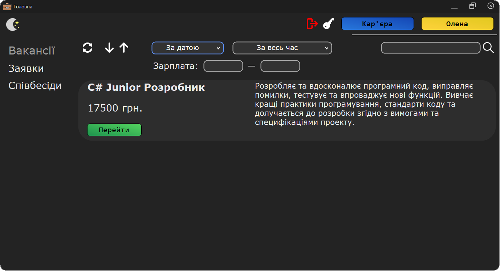

**Registration and Login**

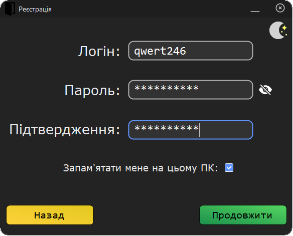
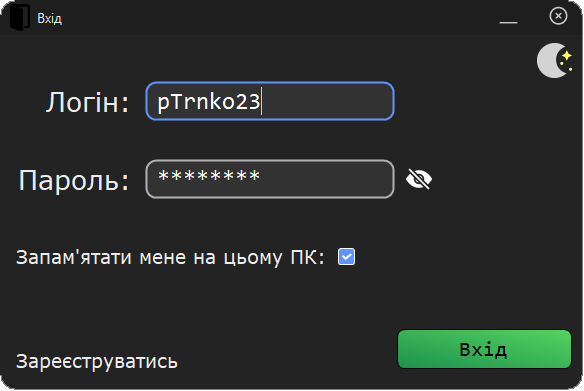

**User Profile and Questionnaire**

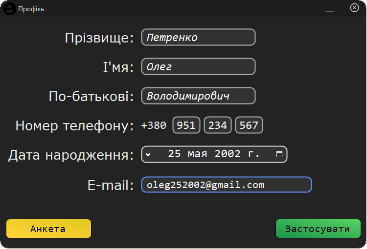
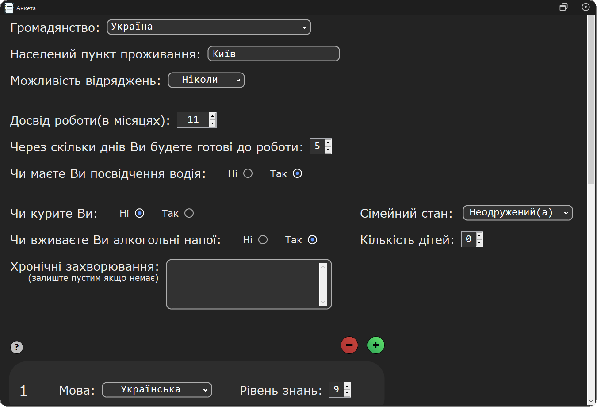

**Vacancy Overview**

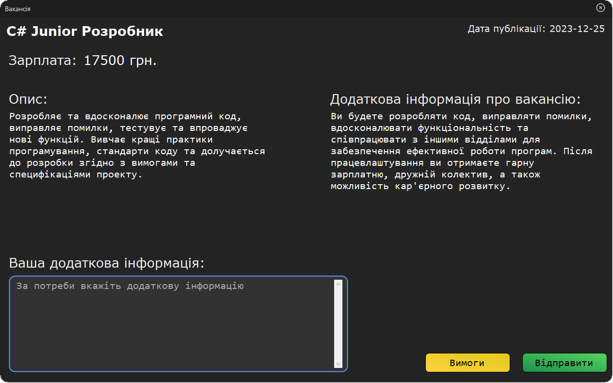

### Server Application

**Main Form**

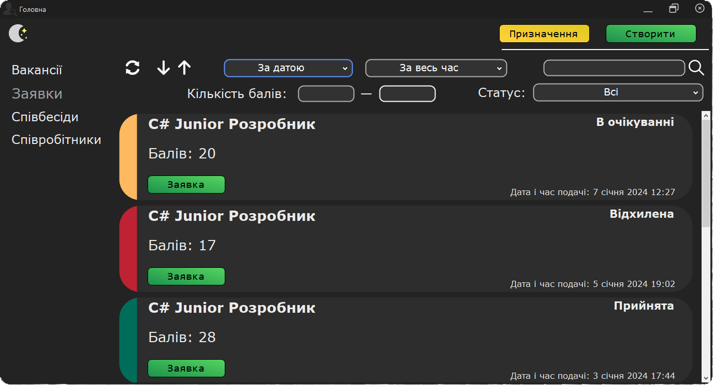

**Vacancies, Applications and Interviews**

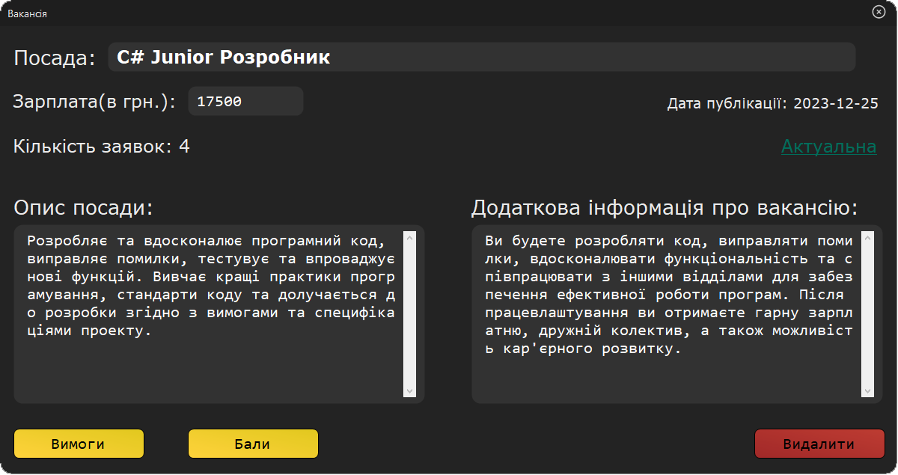
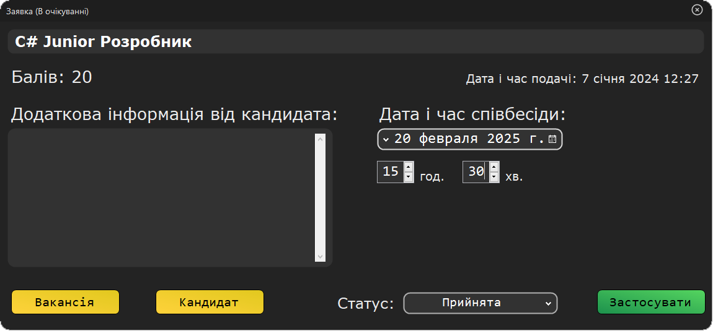
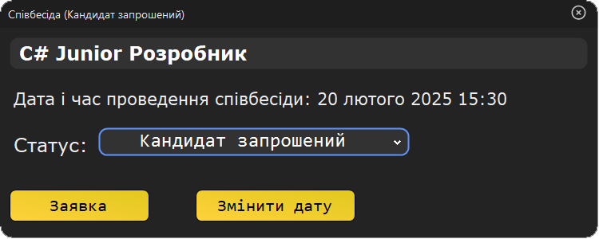

**Employees and Assignments**

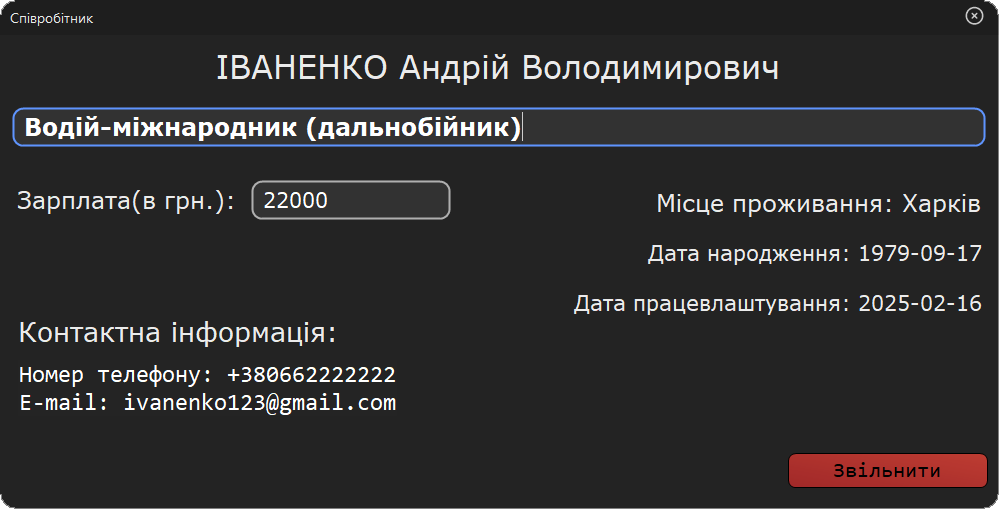
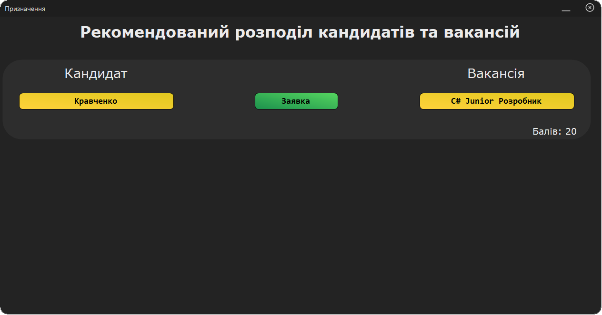
